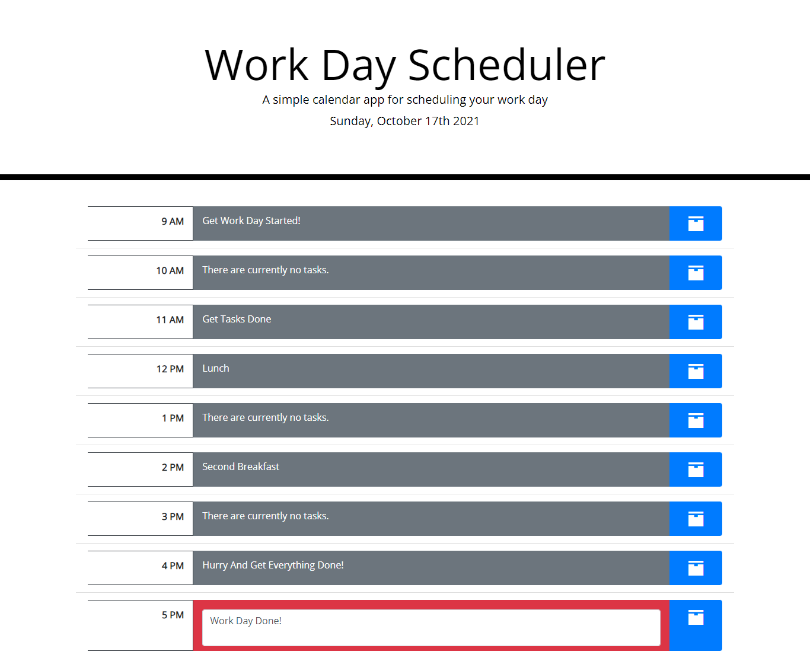

# Work Day Scheduler
## Description
- This work scheduler helps us visualize and organize tasks in our wok day by the hour so we can stay productive and see at a glance what we need to get done and how much time we have to do so.
- To build this project, I first started with bootstrap for the layout and then used moment.js for the time. I ran the time through some if/else statements and then worked on allowing the user to edit and save tasks to their local storage so that they can be accessed on reload.
- I ran into some problems with the hours and in the future I would like to change the logic I used to check and change the hour colors but I am happy with how everything turned out in the time that I had.
## Table of Contents
- [Usage](#usage)
- [Credits](#credits)
- [License](#license)
## Usage
View webpage and enter in work tasks according the hour.
### Screenshot

### Links
- [Link](https://haileythomas.github.io/work-scheduler/) link to view webpage
- [GitHub](https://github.com/HaileyThomas/work-scheduler) link to GitHub
## Credits
ASU Coding Boot Camp for the starter code.
## License
MIT License

Copyright (c) [2021] [HaileyThomas]

Permission is hereby granted, free of charge, to any person obtaining a copy
of this software and associated documentation files (the "Software"), to deal
in the Software without restriction, including without limitation the rights
to use, copy, modify, merge, publish, distribute, sublicense, and/or sell
copies of the Software, and to permit persons to whom the Software is
furnished to do so, subject to the following conditions:

The above copyright notice and this permission notice shall be included in all
copies or substantial portions of the Software.

THE SOFTWARE IS PROVIDED "AS IS", WITHOUT WARRANTY OF ANY KIND, EXPRESS OR
IMPLIED, INCLUDING BUT NOT LIMITED TO THE WARRANTIES OF MERCHANTABILITY,
FITNESS FOR A PARTICULAR PURPOSE AND NONINFRINGEMENT. IN NO EVENT SHALL THE
AUTHORS OR COPYRIGHT HOLDERS BE LIABLE FOR ANY CLAIM, DAMAGES OR OTHER
LIABILITY, WHETHER IN AN ACTION OF CONTRACT, TORT OR OTHERWISE, ARISING FROM,
OUT OF OR IN CONNECTION WITH THE SOFTWARE OR THE USE OR OTHER DEALINGS IN THE
SOFTWARE.
